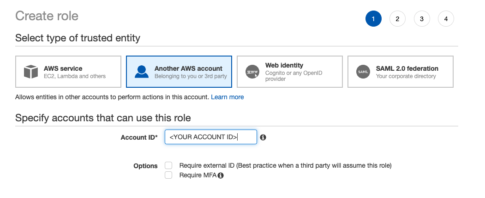

# Arc Auto-Tagging through Kinesis Example
Once content is created in Arc, how do you get it out? The Kinesis stream is your answer! There are many use cases that may require you to pipe your content out of Arc once it's created -- integration with print systems, syncing back to a legacy CMS during your migration to Arc, or performing some automatic operation to content. The last use case is the one covered in this code sample, but this can be adapted to work for any of these use cases. 

# What is Kinesis? What is an Event Stream? 
Kinesis is an AWS Event Stream. Generally, event streams are used to provide insight into events that are happening *as they happen*. Within Arc, we produce an event every time a major action is taken against a piece of content -- if it's updated, published, or deleted, we have an event. More can be read about Arc's Kinesis stream in [Arc Learning Center](https://redirector.arcpublishing.com/alc/arc-products/contentapi/user-documentation/content-event-stream-via-kinesis/). 

## What does this code sample actually do with those events? 
This code sample goes through one of the most sought-after use cases for the Kinesis stream -- auto-tagging. Once an article is published, for example, you may want to tag the story with keywords that are most relevant in order to surface the story within your website. To do this, you may be sending the content to a 3rd party system to generate those tags based on the content. These tags then need to be added to the story to re-saved into Arc. 

Generally, the flow for this would be:
1. A story within Arc is published
2. The story's Publish Event flows to Kinesis
3. Your Kinesis consumer listens to the event 
4. Your application sends the story to another service to be tagged
5. Your application updates the story with the relevant tags
6. Your application POSTs the story back to Draft API to be updated within Arc

This code sample goes through steps 3-6 of that workflow!

This example application uses the [Boto3 Kinesis Library](https://boto3.amazonaws.com/v1/documentation/api/latest/reference/services/kinesis.html) to connect to a Kinesis stream. It also implements the [Boto3 STS Library](https://boto3.amazonaws.com/v1/documentation/api/latest/reference/services/sts.html) in order to provide cross-account access. Cross-Account access means that users outside of the Arc AWS Account will be able to access a Kinesis steam that lives within an Arc AWS Account. 

Setting up cross-account access will require configuring IAM Roles and Policies in both the Arc AWS Account and your Consuming AWS Account. These steps are detailed below in [Setup](#setup).

If your cross-account access is already configured, skip ahead to [Running the Consumer](#running-the-consumer). 


# Setup
## Step 1 - AWS Account Credentials from Consuming Account
In order to consume the Kinesis stream events in another system, we need your AWS Account ID. Please provide us with the AWS Account ID of the account you'll be accessing Kinesis from.

## Step 2 - IAM Roles
Once your account information is known, we can create two IAM Users -- one in each account. The IAM User in the Consuming Account will be paired with the IAM User in the Arc AWS Account in order to enable cross-account access to the Kinesis Stream. 

### IAM Role in the Arc Account

In the Arc account, we'll first create an IAM role that is able to peer with the user you create in your Consuming Account. First, we'll create the policy this role needs:

In the AWS console for the Arc Account create a new IAM role.
* Navigate to IAM > Policies
* Create a policy that can connect to the stream for this particular customer 


```
{
    "Version": "2012-10-17",
    "Statement": [
        {
            "Sid": "Stmt1475084675000",
            "Effect": "Allow",
            "Action": [
                "kinesis:GetShardIterator",
                "kinesis:GetRecords",
                "kinesis:DescribeStream",
                "kinesis:ListStreams",
                "kinesis:ListShards",
                "kinesis:ListStreamConsumers"
            ],
            "Resource": "arn:aws:kinesis:us-east-1:1234567:stream/<ARC STREAM NAME>"
        }
    ]
}
```
Then, we'll create a Role that uses this policy: 

* Navigate to IAM > Roles
* Select "Role for Cross-Account Access"
* Then "Another AWS Account."
* Add the Account ID
* Attached the policy just created




By default, the Trust Relationship on the Role should be populated with your account id:

```
{
  "Version": "2012-10-17",
  "Statement": [
    {
      "Effect": "Allow",
      "Principal": {
        "AWS": "arn:aws:iam::<YOUR ACCOUNT NUMBER HERE>:root"
      },
      "Action": "sts:AssumeRole"
    }
  ]
}
```

### IAM Role in the Consuming Account

Now that the Arc IAM Role has been created, you'll need to set up a IAM role from the Consuming Account. To do that, follow these instructions: 

In the AWS console for the Consuming Account create a new IAM role.
* Navigate to IAM > Policies
* Create a policy that grants access to the Security Token Service.  Use the role ARN The Washington Post provided as the Resource. 

Example policy:
```
{
    "Version": "2012-10-17",
    "Statement": [
        {
            "Sid": "Stmt1475158944000",
            "Effect": "Allow",
            "Action": [
                "sts:*"
            ],
            "Resource": [
                "<WAPO ARN HERE>"
            ]
        },
         {
             "Sid": "Stmt1475084967000",
             "Effect": "Allow",
             "Action": [
                 "dynamodb:CreateTable",
                 "dynamodb:DescribeTable",
                 "dynamodb:DeleteItem",
                 "dynamodb:GetItem",
                 "dynamodb:PutItem",
                 "dynamodb:Scan",
                 "dynamodb:UpdateItem"
             ],
             "Resource": [
                 "*"
             ]
         },
         {
             "Sid": "Stmt1475085048000",
             "Effect": "Allow",
             "Action": [
                 "cloudwatch:PutMetricData"
             ],
             "Resource": [
                 "*"
             ]
         }
    ]
}
```
Once the policy has been created, create a user. 

* Navigate to IAM > Users > Add User
* Ensure your user has Programmatic Access in order to generate an Access Key and Secret.
* In the Permissions screen, attach the policy that you created in the step above. 
* Once created, you'll have the opportunity to download a .csv with the Access Key and Secret. Download this for use later. 

## Step 3 - Configure your .env and AWS Profile
Get the Arc AWS Account IAM Role ARN, IAM Policy ARN, and Kinesis stream name from Arc. These will be used to populate your .env file.

This consumer example requires a `.env` file in the root directory that includes all your consumer-specific information. Create a `.env` file at the root of your directory with the following information:
```
stream_name=<STREAM NAME GIVEN BY ARC>                      
role_arn=<ROLE ARN GIVEN BY ARC>
policy_arn=<POLICY ARN GIVEN BY ARC>
region=<REGION GIVEN BY ARC>
arc_dev_token=<DEVELOPER TOKEN USED TO MAKE DRAFT API REQUESTS>
arc_org_name=<ARC ORGANIZATION ID>
access_key=<CONSUMING AWS ACCOUNT ACCESS KEY OR BLANK>
access_secret=<CONSUMING AWS ACCOUNT ACCESS SECRET OR BLANK>
```
The values will look similar to this example:
```
stream_name=com.arcpublishing.organization.contenttype.version
role_arn=arn:aws:iam::123456789:role/role-name
policy_arn=arn:aws:iam::123456789:policy/policy-name
region=us-east-1
arc_dev_token=L5K1...........
arc_org_name=theherald
access_key=
access_secret=
```

This consumer example provides two different ways of setting your AWS Credentials. 

### AWS Credentials Profile

The first is to use an AWS Profile, follwing the official [AWS Guide](https://docs.aws.amazon.com/cli/latest/userguide/cli-configure-quickstart.html). With this example, you will add a profile to your `~/.aws/credentials` file which includes your Access Key and Secret: 
```
[profile-name]
aws_access_key_id = AK....
aws_secret_access_key = rh......
```
Then, you will export this profile, `export AWS_PROFILE=profile-name` in the command line. Once this is completed, `boto3` will be able to pull in these credentials without you explictly setting them anywhere in the code. 

### .env Configuration

If you prefer to not use an AWS Profile, you can set `access_key` and `access_secret` in your `.env` file. **If these values are set, they will take precedence and the consumer will not attempt to use your AWS Profile.**

```
stream_name=com.arcpublishing.organization.contenttype.version
role_arn=arn:aws:iam::123456789:role/role-name
policy_arn=arn:aws:iam::123456789:policy/policy-name
region=us-east-1
arc_dev_token=L5K1...........
arc_org_name=theherald
access_key=ABC123.....
access_secret=ABC123.....
```


# Running the Consumer
The consumer runs in Python 3. First, ensure that [Python 3](https://www.python.org/downloads/) is installed on the machine, either through Python's direct downloads or [through HomeBrew](https://docs.python-guide.org/starting/install3/osx/). 

Next, install the required libraries. 
```
pip install -r requirements.txt
```


Once your `.env` is configured and you've install the required libraries via `pip`, you are ready to run the consumer.
```
python app.py
```

By default, the consumer is set up to listen for published stories, and then use Draft API to add a test tag. Once you're successfully stream records, though, the world is your oyster! 

# Now What?

Once you have the Kinesis Consumer running successfully, there are a few places to make edits for your specific use case. This example is set up to add the same tag to every published story, which is likely not exactly what you're trying to do. 

## Which records to match?

First, you need to tell the consumer which records to match for tagging. Currently, this is Line #56 of `app.py`. This line reads: 

```
if record.get('operation') == 'insert-story' and record.get('published') == True:
```

This is saying to only tag stories that come through via Publish Insert-Story messages, which are the equivalent of Publish events. If there is other criteria you want to add, this is the place to do it. The schema for the messages can be found in our [Kinesis Documentation](https://github.com/washingtonpost/ans-schema/blob/master/src/main/resources/schema/ans/0.10.7/content_operation.json). 

## What to do with the records?

Once a record is matched, this consumer sends the record to `tag.autotag()` which lives in the `utility/tag.py` file. `tag.py` follows a few steps:

1. First, use the `_id` given in the record to grab the latest revision of the document from Draft API. Only a subset of the revision is placed in the Kinesis message, so it's always best to go grab the entire document in order to avoid any collisions. 
2. Figure out the Tag to add to the story. In this consumer, the tag `kinesis-autotag` is always being added. In your use case, you may wish to further inspect the story to determine the tag, call out to a third party service, etc. This is handled in Line #59 of `utility/tag.py`
3. Once the tag is figured out, the consumer modifies the ANS to include that tag in its list of tags.
4. Finally, the autotag function updates the Draft revision in Draft API with the new tag. 

**NOTE: Out of the box, this consumer does not re-publish your document to propogate the change to the published revision. You likely want to add this.**

## Anything else to consider?

As a reminder, this code is meant as an example, and to abstract away some of the more tedious AWS connection code. There are many places you may want to adapt this example to meet your needs, which auto-publishing, further filtering on content, etc. This sample is also built to run locally and is not Dockerized or set up for any easy CICD that you may wish to adopt for your organization. 

Finally, the current iteration of Draft API does not include a locking mechanism, which means that auto-tags to Draft API can occassionally overwrite a Composer user if that user is editing a document simultaneously. Further iterations of Draft API slotted for 2021 will introduce a locking feature that will get adding to this code sample at that time and that will prevent API overrides to Composer users. 

# What Data is Available?

Your Kinesis stream is populated with records about your stories, videos, and images. The objects on the stream abide by the ANS Schemas as listed below:
* [Stories](https://github.com/washingtonpost/ans-schema/blob/master/src/main/resources/schema/ans/0.10.7/content_operation.json)
* [Images](https://github.com/washingtonpost/ans-schema/blob/master/src/main/resources/schema/ans/0.10.7/image_operation.json)
* [Videos](https://github.com/washingtonpost/ans-schema/blob/master/src/main/resources/schema/ans/0.10.7/video_operation.json)

